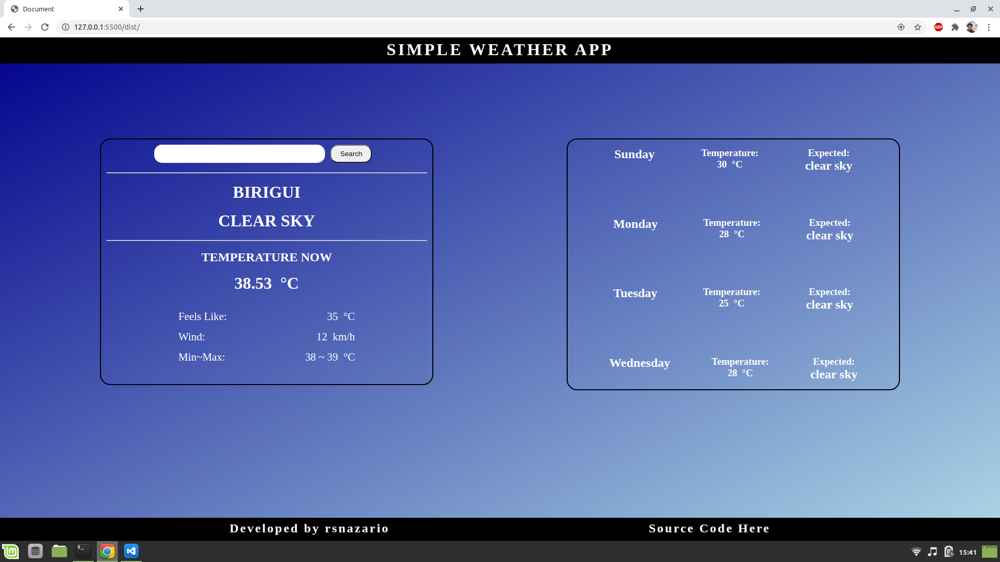

# weather-app-js
Javascript Weather App Dealing with API's and Async / Await Functionalities.


## Screenshots



## Online Version
 [Live Demo ](https://rsnazario.github.io/weather-app-js/)

## Content

* [Features](#features)
* [Built With](#built-with)
* [Getting Start](#getting-start)
* [Contributing](#contributing)
* [Acknowledgments](#acknowledgments)
* [Authors](#authors)

## Features

<ul>
  <p>Any User Can:</p>
  <li>Allow Browser To Acces Location</li>
  <li>Search Any City for its weather information</li>
</ul>

## Built With

- HTML5
- CSS3
- Javascript
- Webpack
- ESLint (Linter) with Stickler (CI Tool)
- Git, Github and VScode
<br>

## Getting Start

#### Get a local copy
Now you need a copy of this application, if you are using Git:
```js
git@github.com:rsnazario/weather-app-js.git
```
Otherwise just hit (Download Zip) on green button (Clone or Download) at top of this page.

#### Run App

Since this project already provides the required files for setting up the Webpack, just type on your terminal:

`
npm install
`
Now, you can just open your *Visual Studio Code* and click on `Go Live` or you can run on your terminal:

`
npm run server
`
If you run on your terminal, just scroll up and click on the link of the opened port on your terminal while holding the key CTRL.

### Contributing

Contributions, issues and feature requests are welcome!

You can do it on [issues page](issues/).

## Acknowledgments

A special thanks for all Microverse Team and Code Reviewers that guides me through my learning.

## Authors

👤 **Rafael Nazario**

- Github: [@rsnazario](https://github.com/rsnazario)
- Twitter: [@@rsnazario](https://twitter.com/@rsnazario)
- Linkedin: [Rafael Nazario](https://www.linkedin.com/in/rsnazario/)

## Show your support

Give a ⭐️ if you like this project!
